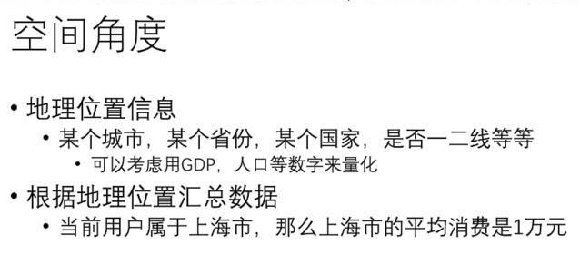
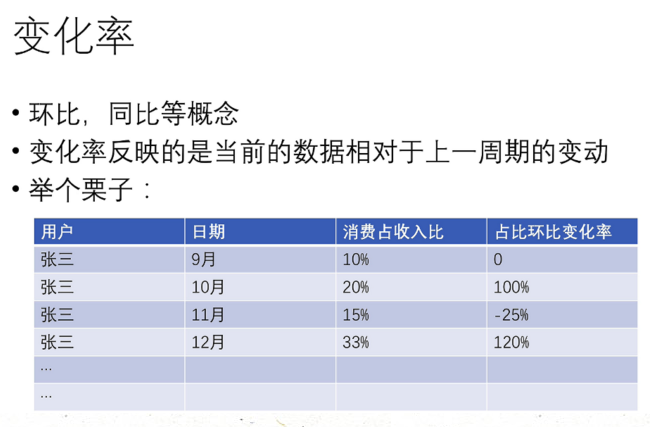

良好的数据要能够提取出良好的特征才能真正发挥效力。

预处理/数据清洗是很关键的步骤，往往能够使得算法的效果和性能得到显著提高。归一化、离散化、因子化、缺失值处理、去除共线性等，数据挖掘过程中很多时间就花在它们上面。这些工作简单可复制，收益稳定可预期，是机器学习的基础必备步骤。

<h1 align = "left">:helicopter: 数据预处理 :running:</h1>

---

# 1. 数据清洗

## 1.1 处理缺失值

常见的缺失值补全方法：均值，中值，众数插补、建模预测、高维映射<br>
（1）连续值<br>
特征值为连续值：按不同的分布类型对缺失值进行补全：偏正态分布，使用均值代替，可以保持数据的均值；<br>
偏长尾分布，使用中值代替，避免受outlier的影响<br>
（2）离散值<br>
使用众数代替，或者直接编码为'其他'<br>
（3）建模预测<br>
将缺失的属性作为预测目标来预测，将数据集按照是否含有特定属性的缺失值分为两类，利用现有的机器学习算法对待预测数据集的缺失值进行预测<br>
该方法的根本的缺陷是如果其他属性和缺失属性无关，则预测的结果毫无意义，但是若预测结果相当准确，则说明这个缺失属性是没必要纳入数据集中的，一般的情况是介于两者之间<br>
（4）高维映射star<br>
将属性映射到高维空间，采用独热码编码（one-hot）技术。将包含K个离散取值范围的属性值扩展为K+1个属性值，若该属性值缺失，则扩展后的第K+1个属性值置为1<br>
这种做法是最精确的做法，保留了所有的信息，也未添加任何额外信息，若预处理时把所有的变量都这样处理，会大大增加数据的维度。这样做的好处是完整保留了原始数据的全部信息、不用考虑缺失值；缺点是计算量大大提升，且只有在样本量非常大的时候效果才好<br>

如果连续型变量缺失率比较高，可以先变成类别型0和1，看下与label的IV值

部分代码：<br>
```python
from sklearn.preprocessing import Imputer
im =Imputer(strategy='mean') # mean, median, most_frequent
im.fit_transform(X)
```

## 1.2 数据平滑

比如分箱，贝叶斯平滑[代码](BayesianSmoothing.py)
 
## 1.3 文本数据清洗

在比赛当中，如果数据包含文本，往往需要进行大量的数据清洗工作。如去除HTML 标签，分词，拼写纠正, 同义词替换，去除停词，抽词干，数字和单位格式统一等

# 2. 数据集成

(1) 将多个数据源中的数据结合起来并统一存储，建立数据仓库的过程实际上就是数据集成，具体来讲就是将分散在不同来源的数据有机地整合到一起的一步，例如宽表整合<br>
(2) 提供的数据散落在多个文件，需要根据相应的键值进行数据的拼接

# 3. 数据变换

## 3.1 特征变换

主要针对一些长尾分布的特征，需要进行幂变换或者对数变换或box-cox变换，使得模型（LR或者DNN）能更好的优化。<br>
需要注意的是，Random Forest 和 GBDT 等模型对单调的函数变换不敏感。其原因在于树模型在求解分裂点的时候，只考虑排序分位点
 
## 3.2 特征编码

一、Binarization 特征二值化是将数值型特征变成布尔型特征
```python
from sklearn.preprocessing import Binarizer
bi = Binarizer(threshold=2)           # 设置阈值默认2.0  大于阈值设置为1 , 小于阈值设置为0
bi.fit_transform(df[['dd']])    # shape (1行,X列)
```

二、连续性变量划分份数，对定量特征多值化（分箱）
```python
import pandas as pd
pd.cut(df['app'],bins=5) # bin：int 在x范围内的等宽单元的数量
```

三、one-hot Encoding / Encoding categorical features
```python
pandas.get_dummies(df, prefix=None, prefix_sep='_', dummy_na=False, columns=None, sparse=False, drop_first=False)
# dummy_na=False # 是否把 missing value单独存放一列
```

四、LabelEncoder
```python
# 对于Random Forest和GBDT等模型，如果类别特征存在较多的取值，可以直接使用 LabelEncoder 后的结果作为特征
from sklearn.preprocessing import LabelEncoder
LabelEncoder().fit_transform(X)
```

**特征编码遇到的问题**<br>
对于取值较多（如几十万）的类别特征（ID特征）<br>
(1) 统计每个取值在样本中出现的频率，取 Top N 的取值进行 One-hot 编码，剩下的类别分到“其他“类目下，其中 N 需要根据模型效果进行调优<br>
(2) 统计每个 ID 特征的一些统计量（譬如历史平均点击率，历史平均浏览率）等代替该 ID 取值作为特征<br>
(3) 参考 word2vec 的方式，将每个类别特征的取值映射到一个连续的向量，对这个向量进行初始化，跟模型一起训练。训练结束后，可以同时得到每个ID的Embedding

 
## 3.3 数据标准化、正则化
 
**数据归一化有两个作用：（1）消除异方差（2）加快了梯度下降求最优解的速度**
 
（1）min-max标准化(MinMaxScaler) 特征缩放至特定范围 <br>
对于每个属性，设minA和maxA分别为属性A的最小值和最大值，将A的一个原始值x通过min-max标准化映射成在区间[0,1]中的值x'，其公式为：新数据 =（原数据 - 最小值）/（最大值 - 最小值）<br>
公式：新数据 =（原数据 - 最小值）/（最大值 - 最小值）<br>
```python
from sklearn.preprocessing import MinMaxScaler
mns = MinMaxScaler((0,1))
mns.fit(X)

x_train_mns = mns.transform(X)
```
（2）z-score标准化(Standardization)<br>
基于原始数据的均值（mean）和标准差（standarddeviation）进行数据的标准化。将A的原始值x使用z-score标准化到x'。z-score标准化方法适用于属性A的最大值和最小值未知的情况，或有超出取值范围的离群数据的情况。新数据 =（原数据- 均值）/ 标准差 <br>
公式：新数据 =（原数据- 均值）/ 标准差<br>
```python
from sklearn.preprocessing import StandardScaler
sds = StandardScaler()
sds.fit(X)

x_train_sds = sds.transform(X)
```
（3）数据正则化（归一化）<br>
每个属性值除以其Lp范数，将样本缩放到单位范数(一般不用在这里)
```python
from sklearn.preprocessing import Normalizer
Normalizer().fit_transform([[1,2,3],[11,22,23]])
# 一般计算两个向量[1,2,3]，[11,22,23]的余弦相似的时候用的比较多
# 一般不对特征进行正则化处理
```

# 4. 数据归约

- **维规约**（检测并删除不相关、弱相关或冗余的属性或维）<br>
- **数据压缩**（小波或傅立叶变换以及主成份分析）

--- 

<h1 align = "left">:helicopter: 数据探索与分析 :running:</h1>

---
从两个方面进行分析

# 1. 数据质量分析

## 1.1 描述性统计

数据类型、缺失值、异常值、重复数据、不一致的值等

# 2. 数据特征分析

## 2.1 分析特征变量的分布

### 2.1.1 回归

(1) 特征变量为连续值：
如果为长尾分布（偏度比较大）并且考虑使用线性模型，可以对变量进行幂变换或者对数变换或box-cox。<br>
box-cox进行转换代码<br>
```python
# 先看下哪些特征偏度比较大，从大到小排序
data[num_fts].apply(lambda x: x.skew()).sort_values(ascending=False)
# 然后进行box-cox转换
from scipy.special import boxcox, boxcox1p
for feat in num_fts:
    #all_data[feat] += 1
    data[feat] = boxcox1p(data[feat], 0.15)
```
(2) 特征变量为离散值：观察每个离散值的频率分布，对于频次较低的特征，可以考虑统一编码为“其他”类别。<br>
比如天气特征有晴、阴、雨、刮风、雪，如果刮风和雪的频次较低则可编码为'其他'

### 2.1.2 分类

同上

## 2.2 分析目标变量的分布

### 2.2.1 回归

目标变量一般为连续值：查看其值域范围是否较大，是否有偏，<br>
如果较大，可以考虑对其进行对数变换，并以变换后的值作为新的目标变量进行建模（在这种情况下，需要对预测结果进行逆变换）。一般情况下，可以对连续变量进行Box-Cox变换。通过变换可以使得模型更好的优化，通常也会带来效果上的提升。<br>
如果有偏，又想用线性模型，则需要将其变成normally distributed data(np.log1p())<br>

### 2.2.2 分类

目标变量一般为离散值：如果类别分布不平衡，考虑是否需要上采样/下采样；如果目标变量在某个ID上面分布不平衡，在划分本地训练集和验证集的时候，需要考虑分层采样(Stratified Sampling)。<br>
下采样最好结合业务场景，(或业务规则)，让负样本急剧下降。

针对反欺诈场景，类别不平衡的情况：<br>
（i）欠采样(用的比较多)，每次好样本抽样，坏样本都保留<br>
（ii）过采样(SMOTE: Synthetic Minority Over-sampling Technique)
```python
from imblearn.over_sampling import SMOTE
# SMOTE Technique (OverSampling) After splitting and Cross Validating
sm = SMOTE(ratio='minority', random_state=42)
Xsm_train, ysm_train = sm.fit_sample(original_Xtrain, original_ytrain)
```

## 2.3 分析特征变量和目标变量之间的关系

### 2.3.1 回归

（1）类别型特征，画boxplot，好特征有高低区别<br>
 ```python
import matplotlib.pyplot as plt
import seaborn as sns
%matplotlib inline
fig = sns.boxplot(x='col_1', y="label", data=data)
fig.axis(ymin=0, ymax=100); # y轴设置
```
（2）数值型特征，画scatterplot，好特征呈现一定趋势<br>
```python
data.plot.scatter(x='col_1', y='label', ylim=(0, 100))
```
（3）把类别型用LabelEncoder转成数值型然后画关系矩阵<br>
```python
corrmat = data_train.corr()
f, ax = plt.subplots(figsize=(20, 9))
sns.heatmap(corrmat, vmax=0.8, square=True)
```

### 2.3.2 分类

（1）计算logloss或KL散度，看两个分布的差异性（越大越好）<br>
（2）画关系矩阵（同上回归）

## 2.4 分析变量之间两两的分布和相关度

关系矩阵分析连续变量之间线性相关程度的强弱，可以用于发现高相关和共线性的特征。

## 2.5 周期性分析

探索某个变量是否随着时间变化而呈现出某种周期变化趋势

[链接地址](https://m.sohu.com/a/139981834_116235)

---

```python
import DataFrameSummary # from pandas_summary import DataFrameSummary
dfs = DataFrameSummary(df)
```

- 列类型: dfs.columns_types <br>
```python
floating     9
integer     3
boolean        3
categorical 2
date        1
string        1
dtype: int64
```

- 列统计: dfs.columns_stats

```python
                      A            B        C          D          E 
counts             5802         5794     5781       5781       4617   
uniques            5802            3     5771        128        121   
missing               0            8       21         21       1185   
missing_perc         0%        0.14%    0.36%      0.36%     20.42%   
types            integer  categorical  floating    floating    floating 
```

- 相关系数矩阵: dfs.corr

|cor|a|b|c|d|
|:--:|:--:|:--:|:--:|:--:|
|a	|1.000000	|-0.109369  |0.871754	|0.817954|
|b	|-0.109369  |1.000000   |-0.420516  |-0.356544|
|c	|0.871754	|-0.420516  |1.000000	|0.962757|
|d	|0.817954	|-0.356544  |0.962757	|1.000000|


- 列汇总: 单列dfs['a'], 所有列dfs.summary()
```python
std                                                                 0.2827146
max                                                                  1.072792
min                                                                         0
variance                                                           0.07992753
mean                                                                0.5548516
5%                                                                  0.1603367
25%                                                                 0.3199776
50%                                                                 0.4968588
75%                                                                 0.8274732
95%                                                                  1.011255
iqr                                                                 0.5074956
kurtosis                                                            -1.208469
skewness                                                            0.2679559
sum                                                                  3207.597
mad                                                                 0.2459508
cv                                                                  0.5095319
zeros_num                                                                  11
zeros_perc                                                               0,1%
deviating_of_mean                                                          21
deviating_of_mean_perc                                                  0.36%
deviating_of_median                                                        21
deviating_of_median_perc                                                0.36%
counts                                                                   5781
uniques                                                                  5771
missing                                                                    21
missing_perc                                                            0.36%
types                                                                 numeric
Name: A, dtype: object
```

--- 

<h1 align = "left">:helicopter: 数据预处理总结 :running:</h1>

### 常用的转换类

再让我们回归一下本文开始的特征工程的思维导图，我们可以使用sklearn完成几乎所有特征处理的工作，而且不管是数据预处理，还是特征选择，抑或降维，
它们都是通过某个类的方法fit_transform完成的，fit_transform要不只带一个参数：特征矩阵，要不带两个参数：特征矩阵加目标向量。


### 特征工程选择

 - 时间
 - 空间
 - 比率值
 - 变化率
 
<br>
<br>
<br>
<br>
<br>
