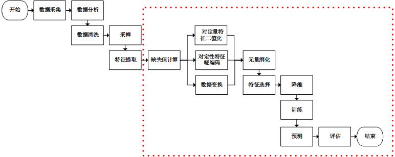

# 特征工程笔记

> 版本：0.0.2 
> 作者：binzhou 
> 邮件：binzhouchn@gmail.com 

`Github` 加载 `.ipynb` 的速度较慢，建议在 [Nbviewer](http://nbviewer.ipython.org) 中查看该项目。

---

## 简介

默认安装了 `python 3.5`，以及相关的第三方包 `ipython`， `numpy`， `scipy`，`pandas`。

> life is short. use python.

推荐使用[Anaconda](http://www.continuum.io/downloads)，这个IDE集成了大部分常用的包。

推荐下载[Anaconda-tsinghua](https://mirrors.tuna.tsinghua.edu.cn/)，清华镜像或者[USTC](http://mirrors.ustc.edu.cn/anaconda/archive/)下载速度快。

## 目录

- [1. **特征工程是什么**](01)

- [2. **数据预处理**](02)
	 - 2.1 无量纲化
	 	- 2.1.1 标准化
	 	- 2.1.2 区间缩放法
	 	- 2.1.3 归一化
	 - 2.2 缺失值计算

- [3. **特征变换**](03)
	 - 3.1 特征变换
	 - 3.2 特征编码
	 	- 3.2.1 对定量特征二值化
	 	- 3.2.2 对定量特征多值化（分箱）
	 	- 3.2.3 对定性特征哑编码

- [4. **特征选择**](04)
	 - 4.1 Filter
	 	- 4.1.1 方差选择法
	 	- 4.1.2 相关系数法
	 	- 4.1.3 卡方检验
	 	- 4.1.4 互信息法（看特征与label的分布）
		- 4.1.5 IV值（常用）
	 - 4.2 Wrapper
	 	- 4.2.1 递归特征消除法
	 - 4.3 Embedded
	 	- 4.3.1 基于惩罚项的特征选择法
	 	- 4.3.2 基于树模型的特征选择法（常用）

- [5. **降维**](05)
	 - 5.1 主成分分析（PCA）
	 - 5.2 线性判别分析法（LDA）

- [6. **总结**](06)

附：数据挖掘步骤图

- [7. **数据挖掘pipeline**](07)

 
 

上述方法都已写入[代码](binzhou_pac.py)中，有待补充

[特征工程干货链接地址](https://www.cnblogs.com/5poi/p/7240601.html)