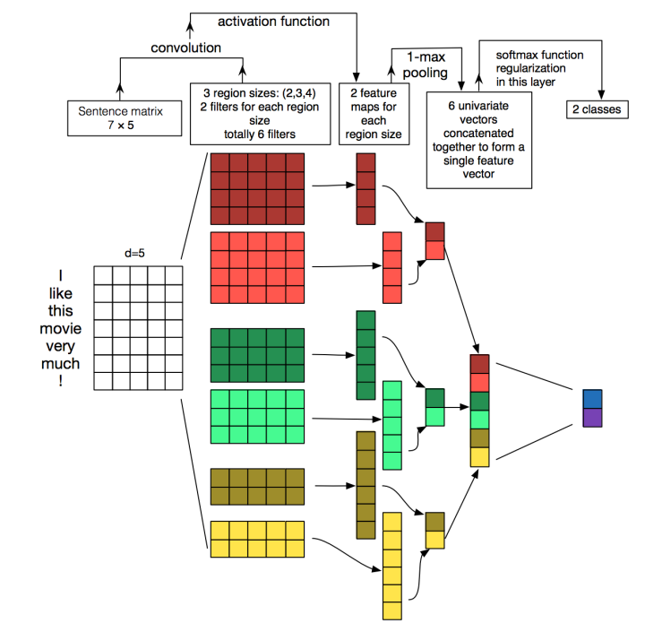

# 面试中常见的问题:running:

## 1. 聊聊项目

**1.1 最熟悉的项目（描述一下流程最全的项目：客服bot）**

[金融智能客服项目流程](../3_3_nlp_text/.机器人流程及遇到的问题.md)

相似问匹配：词向量+[WMD](https://blog.csdn.net/cht5600/article/details/53405315) 
比较新问题与知识库中问题的相似度，每个新问题与知识库中的问题都有一个最小化的值，
比较这个最小化的值谁最小谁就最相似

意图识别其实就是召回（召回又叫采样，选场景） 
重排序 
结合业务过滤层 

**1.2 风控项目**

【金融风控支付反欺诈项目】

黑名单：银行黑名单、逾期欠款、欺诈、失联和名单、羊毛党等

数据中台 etl那边要处理好指标 
还有一些埋点数据(实时数据拿不到，比如浏览几次网页后购买)用的都是事后数据 
特征工程：金额相加，离散的比如注册时间取最早的，还有设备登录城市可以unique或者取众数等 
建模一般树模型(rf, GBDT, xgb等)，如果用评分卡方式则可用单变量auc+iv的方式进行筛选

【金融风控中评分卡建模过程】

[1.1和1.2后期合并一下](../3_1_financial_risk/评分卡算法建模流程.md)

【场景问题】
1. 账户被盗以后的欺诈怎么检测：
 - 设备号
 - ip地址
 - 密码重置
 - 消费金额
 - 转出账户和被转入账户之间没有任何人际关联
 - 城市等

2. 骗钱，主动转账行为怎么检测：
 - 金额(突然大额支出)
 - 对方的收款账户是新注册的，而且近几日只有大额收款和提现，没有日常消费
 - 这两个账户之间从未有过直接转账

---

## 2. 项目workflow

 - 确定业务场景及目标
 - 理解实际问题，抽象为机器学习能处理的数学问题
    - 明确可以获得的数据
    - 机器学习的目标是分类、回归还是聚类
    - 算法评价指标：比如AUC, RMSE
 - 创建common sense baseline
 - 获取数据、分割数据(optional)
 - EDA
 - 预处理
 - 特征工程（数据清洗、特征变换、特征衍生、特征筛选）
 - 模型开发
 - 模型集成
 - 模型部署
 - 模型监控
 - 迭代

## 3. 经典的优化方法
 
[梯度下降法](https://zhuanlan.zhihu.com/p/36564434)
选择每一步的方向：泰勒公式！

 - 牛顿法和拟牛顿法
 - 共轭梯度法(Adagrad, Adadelta, RMSprop, Adam)

SGD 
SGD with Momentum 
Adam 
解答：sgd对参数直接求导，momentum是sgd求导加上miu乘以t-1时刻的梯度一阶矩估计
adam有对梯度的一阶矩和二阶矩估计，自适应学习率

SGD和Batch_GD的区别：
sgd每个样本更新一次参数，b_gd是一批次样本更新一次参数，
[具体公式参考](https://www.cnblogs.com/richqian/p/4549590.html) 

[深度学习中的优化](https://blog.csdn.net/nickkissbaby_/article/details/81066643) 
[一个框架看懂优化算法之异同](https://zhuanlan.zhihu.com/p/32230623)

## 4. 推导SVM算法

最大间隔超平面背后的原理：
 - 相当于在最小化权重时对训练误差进行了约束——对比 L2 范数正则化，则是在最小化训练误差时，对特征权重进行约束
 - 相当于限制了模型复杂度——在一定程度上防止过拟合，具有更强的泛化能力

推导看统计学习方法P100

svm损失函数：[合页损失(加正则项)](https://www.jianshu.com/p/fe14cd066077)

## 5. 推导LR算法

顺便可以看下线性回归，损失函数：均方误差MSE

看统计学习方法P78及 
[LR推导及代码实现（推荐）](https://zhuanlan.zhihu.com/p/36670444)

LR损失函数：对数损失logloss(逻辑回归采用对数损失函数来求参数，实际上与采用极大似然估计来求参数是一致的)

## 6. 看下决策树相关的知识点

西瓜书 4.1/4.2/4.3/4.4  
统计学习方法 第五章

信息增益：得知特征X的信息而使得类Y的信息的不确定性减少的程度 
g(D,A) = H(D)-H(D|A) 具体公式含义及计算方式看统计学习方法p61,p62 
【缺点】以信息增益作为划分训练数据集的特征，存在偏向于选择取值较多的特征的问题

信息增益比（改进信息增益的缺点）：g(D,A) / Ha(D)

ID3用的是信息增益 
C4.5用的是信息增益比 
CART：回归MSE；分类Gini，gini系数越小越好

[cart剪枝](https://www.zhihu.com/question/22697086)

注意看下ID3, C4.5/C5.0的属性都要是离散的，CART的属性可以是连续的，
而且cart是回归树，后面用的默认的rf, xgb, lgb用的都是回归树

Bagging方法：Random Forest

Random Forest：
 - 样本扰动和属性扰动(k=logd)
 - 降低方差
 - 预测：n棵树投票

Boosting方法：Adaboost, GBDT, xgb, lgb

[Adaboost](https://blog.csdn.net/guyuealian/article/details/70995333)
 - 基本思想：调整样本权重
 - 基(弱)分类器选取（一般单层决策树或基于其他算法）
 - 误差率即每个样本的权值中分类错误的样本权值和

[GBDT](https://blog.csdn.net/qq_22238533/article/details/79185969)
 - 基本思想：对上一轮的残差进行拟合
 - GBDT中的树是回归树
 - 提升树是迭代多棵回归树来共同决策。当采用平方误差损失函数时，每一棵回归树学习的是之前所有树的结论和残差，拟合得到一个当前的残差回归树（提升树即是整个迭代过程生成的回归树的累加）
 - 梯度提升决策树(GBDT)
 - [CSDN](https://blog.csdn.net/zpalyq110/article/details/79527653)
 - [简书](https://www.jianshu.com/p/005a4e6ac775)

gbdt的正则化： 
1. 对于每个模型乘以一个系数λ (0 < λ ≤ 1)，降低每个模型对拟合损失的贡献，这种方法也意味着我们需要更多的基学习器 
2. 每次通过按比例（推荐[0.5, 0.8] 之间）随机抽取部分样本来训练模型（交叉验证选取） 
3. 控制基学习器CART树的复杂度，可以减少深度或采用剪枝正则化

[xgb](https://blog.csdn.net/a819825294/article/details/51206410)
 - 损失函数加入正则，并进行泰勒展开用到了二阶导（优点：）
 - 分裂点选取：贪心法、近似直方图算法

[GBDT和xgb的区别](https://www.zhihu.com/question/41354392/answer/98658997)
 - GBDT的基分类器是CART，xgb还支持线性分类器
 - xgb损失函数引入二阶泰勒展开和正则项
 - 列抽样
 - 对缺失值的处理。对于特征的值有缺失的样本，xgboost可以自动学习出它的分裂方向
 - 支持并行，特征并行
 - 分裂时用贪心法和近似直方图算法

[lgb优化](https://zhuanlan.zhihu.com/p/25308051)
 - 带深度限制的Leaf-wise的叶子生长策略
 - 直方图算法(做差加速) 和 双边梯度
 - 直接支持类别特征
 - Cache命中率优化

## 7. 类别不平衡问题

1. 欠采样 

代表算法：EasyEnsemble 
 - 首先通过从多数类中独立随机抽取出若干子集。
 - 将每个子集与少数类数据联合起来训练生成多个基分类器。
 - 最终将这些基分类器组合形成一个集成学习系统。

2. 过采样

代表算法： 

 - Bootstrap少数样本
 - SMOTE(Synthetic Minority Over-sampling Technique)
 - Borderline(SMOTE的一种提升方法)

[过采样参考网址](https://blog.csdn.net/a358463121/article/details/52304670)

3. 阈值移动

基于原始训练集进行学习，但在用训练好的分类器进行预测时，
将再缩放的公式y_new/(1-y_new)=y/(1-y)*(m+/m-) 嵌入到决策过程中，称为“阈值移动”。

## 8. 偏差和方差

泛化误差 = 偏差 + 方差 + 噪声

偏差：偏差度量了学习算法的期望预测与真实结果偏离程度，即刻画了学习算法本身的拟合能力 
方差：方差度量了同样大小的训练集的变动所导致的学习性能的变化，即刻画了数据扰动所造成的影响，或者说学习算法的稳定性

**8.1 过拟合即高方差，如何处理**

 - 增加样本数 
 - 降低模型的复杂度(CV)。比如决策树模型中降低树深度、进行剪枝等 
 - early stopping
 - 加正则L1\L2，使用正则化能够给模型的参数进行一定的约束，避免过拟合(损失函数上) 
 - bagging，模型融合
 - dropout
 - batch norm

dropout为什么能防止过拟合[本质解释]： 
1. dropout可以使网络稀疏，减少参数之间的相互依赖关系 
2. [本质]每次dropout会得到不同的模型，相当于多模型结果取平均，从而降低方差，防止过拟合 

### 9. 生成模型和判别模型

判别模型（LR，SVM，神经网络，CRF）总体特征：
 - 对P(Y|X)建模
 - 对所有样本只构建一个模型，确定总体判别边界
 - 优点：对数据量没生成式这么严格，训练速度快，小数据量下准确率也好些

生成模型（NB，LDA，HMM）总体特征：
 - 对P(X, Y)建模，即P(X, Y) = P(X|Y)P(Y)然后预测P(Y|X) = P(X, Y) / P(X)
 - 通过学习来的联合分布P(X, Y)再结合新样本X，通过条件概率求出Y，没有判别边界
 - 优点：所包含的信息全，可以处理隐变量

[生成模型和判别模型参考链接](https://www.zhihu.com/question/35866596/answer/236886066)

### 10. HMM & CRF

[如何用简单易懂的例子解释条件随机场（CRF）模型？它和HMM有什么区别？](https://www.zhihu.com/question/35866596/answer/236886066) 

### 11. Word2Vec及词嵌入

[秒懂词向量Word2vec的本质（讲的非常好）](https://zhuanlan.zhihu.com/p/26306795)

Word2vec 本质上是一个语言模型，它的输出节点数是 V 个，对应了 V 个词语，本质上是一个多分类问题，
但实际当中，词语的个数非常非常多，softmax归一化慢（分母需要求和）
，会给计算造成很大困难，所以需要用技巧来加速训练 
 - hierarchical softmax
   - 本质是把 N  分类问题变成 log(N)次二分类
 - negative sampling
   - 本质是预测总体类别的一个子集

### 12. CNN & GRU & LSTM & Attention

[CNN(卷积神经网络)、RNN(循环神经网络)、DNN(深度神经网络)的内部网络结构有什么区别](https://www.zhihu.com/question/34681168/answer/84061846) 

[TextCNN详解](https://zhuanlan.zhihu.com/p/25928551) 
TextCNN的详细过程原理图见下： 

[Attention机制](https://zhuanlan.zhihu.com/p/25928551) 
例子：我是中国人那个 
加入Attention之后最大的好处自然是能够直观的解释各个句子和词对分类类别的重要性

[LSTM和GRU比较好的理解] 

LSTM：遗忘门，输入门，输出门和细胞状态；看链接二2.3

GRU：重置门和更新门；看链接二3.3

[链接一](https://blog.csdn.net/qq_28743951/article/details/78974058) 
[链接二](https://zhuanlan.zhihu.com/p/28297161)

### 13. CapsNet 胶囊网络

[揭开迷雾，来一顿美味的Capsule盛宴【科学空间】](https://spaces.ac.cn/archives/4819) 

### 14. Transformer

[[整理]聊聊 Transformer](https://zhuanlan.zhihu.com/p/47812375) 
[图解Transformer](https://blog.csdn.net/qq_41664845/article/details/84969266) 
[Attention is all you need: A Pytorch Implementation](https://github.com/jadore801120/attention-is-all-you-need-pytorch)

### 15. GPT，ELMo，和BERT关联 GPT-2

 - BERT用transformer方法取代了ELMo中用lstm提取特征的方法
 - BERT解决了GPT中单向语言模型的方法，变为Masked双向（借鉴了cbow思想）
 - BERT采用了Fine Tuning方式（两阶段模型：超大规模预训练+具体任务FineTuning）
 
[从Word Embedding到Bert模型—自然语言处理中的预训练技术发展史](https://zhuanlan.zhihu.com/p/49271699) 

### 16. AUC和KS

 
AUC是ROC曲线下方的面积，roc曲线纵坐标TPR(TP/(TP+FN))即召回率，横坐标是FPR( FP/(FP+TN))即(1-Specificity) 
[AUC两种计算方式](https://blog.csdn.net/qq_22238533/article/details/78666436)

[KS](https://blog.csdn.net/cherrylvlei/article/details/80789379)

### 17. 梯度爆炸和消失的解决办法

梯度爆炸：梯度阈值，权重正则，激活函数选择relu，batch_norm 
梯度消失：残差结构（典型GRU/LSTM），激活函数选择relu，batch_norm

### 18. relu效果为什么比sigmoid好

第一，算激活函数时（指数运算），计算量大，反向传播求误差梯度时，求导涉及除法，计算量相对大 
第二，sigmoid函数反向传播时，很容易就会出现梯度消失的情况（在sigmoid接近饱和区时，变换太缓慢，导数趋于0；
而relu函数在大于0的时候梯度是常数）
第三，Relu会使一部分神经元的输出为0，这样就造成了网络的稀疏性，并且减少了参数的相互依存关系，缓解了过拟合问题的发生（
更加符合生物神经元特性）

### 19. 无监督学习

聚类：K-Means, 密度聚类，层次聚类 

[k-means中K值的选取](https://blog.csdn.net/qq_15738501/article/details/79036255) 
[k-means的改进算法kdtree](https://www.cnblogs.com/zfyouxi/p/4795584.html)

PCA 

[PCA基本原理和原理推导](https://blog.csdn.net/u012421852/article/details/80458340)

异常检测 

推荐中的关联规则
生成对抗网络

### 20. MLE和MAP的联系和区别

联系：都是为了找到参数的某一个取值，这个取值使得得到目前观察结果的概率最大 
区别：MAP考虑了模型的先验分布， 而MLE假设模型是均匀分布。 
可以说，MLE是MAP的一种特例（故最大后验估计可以看做规则化的最大似然估计）

[参考网址1](https://blog.csdn.net/ljn113399/article/details/68957062) 
[参考网址2 网址1的样例计算详解](https://www.cnblogs.com/liliu/archive/2010/11/24/1886110.html) 

### 21. 数据没有标注，或者少量标注应该怎么办

 - 根据经验规则或标注样本，从未标注数据中再筛选出一批
 - 根据少量标注数据训练模型，预测排序，人工再标注；循环
 - 半监督：比如模型predict高置信度的结果当成标签再加入到模型中训练（能有几个千分点的提升）
 - 数据增强（比如图片旋转、缩放、裁剪、加噪音、Translation、使用GAN等）
 - 迁移学习（像图片分类）

---

interview总结参考网址：

[牛客网coding](https://www.nowcoder.com/ta/coding-interviews?page=1)

[lintcode](https://www.lintcode.com/problem/)

[牛客网sql](http://www.nowcoder.com/ta/sql)

[机器学习中你不可不知的几个算法常识](https://mp.weixin.qq.com/s/Fh-eQm41DI3rkKjEgC1Yig)

[机器学习、数据挖掘、数据分析岗面试总结](https://blog.csdn.net/Datawhale/article/details/81212235?from=singlemessage&isappinstalled=0) 

[机器学习项目流程](https://www.cnblogs.com/wxquare/p/5484690.html)

[Data Science Question Answer](https://github.com/ShuaiW/data-science-question-answer)

[别人的简历（参考）](https://cyc2018.github.io/page.html#next)
