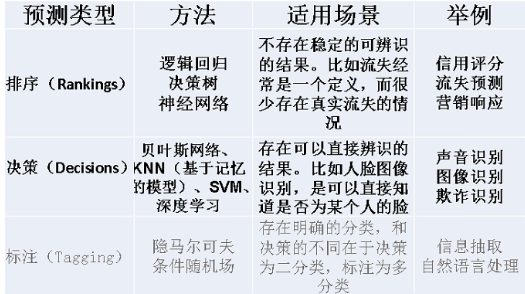
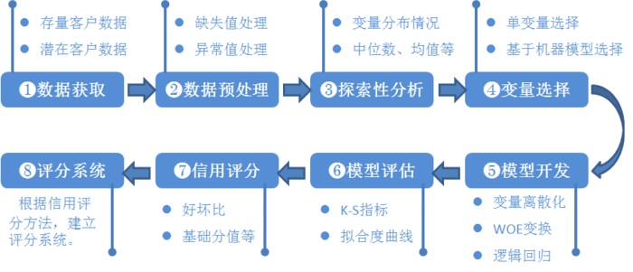

# :running:sn算法建模流程：以评分卡为例:running:

1. 整理业务需求（需求场景，需求指标）

2. 确定算法模型及算法指标

风控与其他领域一样，分类模型主要分为两大类：排序类、决策类、标注类（文本、自然语言处理）<br>


【重要】一般A,B,C卡都用LR（数据源及特征，y的定义不同）<br>
一般数据处理，数值型需要先分箱再WOE编码，类别型如果类别太多也要合并（最好不超过5类，看情况）<br>

为什么要分箱？<br>
 - 一般评分卡用LR做分类器，LR是广义线性的,表达能力受限；单变量离散化为N个后，每个变量有单独的权重，相当于为模型引入了非线性，
 能够提升模型表达能力，加大拟合
 - 可以去除异常值，并提高泛化能力

3. 确定使用的数据（数据存在多张表中，根据某个key进行join）

(Key_id, 观察期X)与(Key_id, 表现期y)进行join<br>
可能特征数据存在多张表中，join起来构造建模用宽表

4. (optional)如果数据和特征都比较多，可以进行粗筛

4.1 特征归约：缺失率、uniqueness或低方差、低IV<br>
4.2 样本归约：重复样本、异常样本(聚类或孤立森林)、根据具体的业务需求（比如只选3个月或6个月的样本）<br>
4.3 去除与解释变量相关性不大的特征变量，降低后续工作量(随机森林)

5. 数据预处理

5.1 缺失值填充：数值型（中位数），类别型（众数、单独为一类）<br>
5.2 异常值处理：四分位差、95%<br>
5.3 格式转换（主要针对时间特征）

6. 特征衍生、变换及编码

6.1 特征衍生：统计特征、排序特征、计数特征<br>
6.2 特征变换：比率特征、平滑(log变换)、boxcox变换（变正态分布）<br>
6.3 特征编码：1、无监督：等频，等距，one-hot(评分卡中不需要)；2、有监督：分箱，WOE，好坏样本比等<br>

7. 特征细筛

【评分卡中如果用LR，则需要特征归一化、分布正态化(boxcox变换)及去多重共线性】<br>
7.1 去除相关性高的和多重共线性；<br>
7.2 去除低IV；<br>
7.3 用随机森林跑一下变量重要性，确定重要程度高的（拐点），把重要程度低的但IV高的重新加进来<br>
7.4 如果变量还是很多，则根据指标场景(比如用户指标，商品指标)，在各个场景中取topN

8. 建模

8.1 用LR建模，如果评价指标是KS则要把pred_prob转成pred_log_prob<br>
8.2 (高级)GBDT生成新特征，每棵树路径直接作为LR输入特征；或模型融合bagging，stacking<br>
8.3 (前沿)稳定性判断PSI、

9. 压测、A/B test

10. 部署上线

hiveSQL<br>
python restful api<br>
PMML(Java)

11. 模型监测及报表生成

11.1 为什么要监测模型
  - 影响模型的因素
    - 消费行为的变化：整体经济形势的变化
    - 市场的转移：新的市场营销策略
    - 行业的变化：新的法令法规
  必须确保信用评分模型被正确的使用，必须定期的验证模型的适用性
  
11.2 模型监测的内容
  - 前端监控--模型的稳定性
    - 评分稳定性指标
    - 特征分布指标
  后端监控--模型的正确性
    - 模型正确性指标
    - 变量有效性指标
    
12. 模型迭代

一段时间后可能效果变差，需要用最新数据或扩充数据重新训练模型


---


# 金融风控评分卡建模过程（以上补充）

## 1. 信用风险及基本概念

什么是信用风险<br>

交易对手未能履行约定契约中的义务而造成经济损失的风险,即受信人不能履行还本付息的责任而使授信人的预期收益与实际收益发生偏离的可能性它是金融风险的主要类型

坏样本的定义<br>
 - M3 & M3+ 逾期
 - 债务重组
 - 个人破产
 - 银行主动关户或注销
 - 其他相关违法行为
 
M0,M1,M2的定义<br>
 - M0:最后缴款日的第二天到下一个账单日
 - M1:M0时段的延续,即在未还款的第二个账单日到第二次账单的最后缴款日之间
 - M2:M1的延续,即在未还款的第三个账单日到第三次账单的最后缴款日之间
 
什么是评分卡<br>

以分数的形式来衡量风险几率的一种手段<br>
是对未来一段时间内违约/逾期/失联概率的预测<br>
有一个明确的(正)区间<br>
通常分数越高越安全<br>
数据驱动（搜集数据，对数据研究，建立模型）<br>
反欺诈评分卡(F卡)、申请评分卡(Application)、行为评分卡(Behavior)、催收评分卡(Collection)<br>
 - 反欺诈评分卡、申请评分卡是在贷前准入环节里面
 - 申请评分卡用到的大部分是申请者的背景变量，而且这个模型一般也会比较谨慎
 - 行为评分卡表示申请者已经获准贷款，已经放出贷款以后，根据贷款人的消费习惯，还款情况等一些信用特征，就是跟踪客户合同开始后的表现，来预估用户逾期或者是违约概率
 - 催收评分卡是对已经逾期或者违约的客户，对他进行一个催收评分，严格来讲，有三个模型，还款率模型，账龄滚动模型，失联模型
 
## 2. 数据准备

 - 数据量，一个优秀的性能模型需要训练数据的数量10倍于该模型中参数的数量
 - 界定这些数据样本的观察期和表现期。观察期是指在设定的观察日之前的一段时间，表现期是指客户观察日之后的一段时间。
 对于信用评分而言，需要用观察期内申请人的信用历史及表现（X），以及表现期内申请人的还款表现（Y），通过模型拟合出X与Y之间的关系
   - 观察期 - 1、搜集变量、特征的时间窗口,通常3年以内 2、带时间切片的变量（比如过去半年还款情况；过去每个月最大还款额等带时间切片的特征）
   - 表现期 - 搜集是否触发坏样本定义的时间窗口,通常6个月~1年 
 

## 3. 数据预处理及特征衍生

 - 处理缺失值和异常值，格式转换(看下时间特征scorecard.py)
 - 变量衍生(统计特征、排序特征、计数特征)
 - 分箱（ChiMerge，BestKS）(scorecard.py第三步和scorecard_functions.py) 分箱可以让变量鲁棒性更好，能去除异常值并且泛化能力好
 - WOE编码(scorecard_functions.py第四步) 可以加入先验label信息

ChiMerge：自底向上数据离散化方法。具有最小卡方值的相邻区间合并在一起，直到满足确定的停止准则。<br>
基本思想：对于精确的离散化，相对类频率在一个区间内应当完全一致。因此，如果两个相邻的区间具有非常类似的类分布，
则这两个区间可以合并；否则，他们应当保持分开。而低卡方值表明它们具有相似的类分布。（卡方检验一般用于检验一个样本是否符合预期的一个分布）
(注意：卡方合并的时候如果一个箱都是好/坏样本则需要合并，必须保证所有箱都有好坏样本，为了后续求WOE有意义)

## 4. 变量分析与选择

 - 变量挑选的依据
   - 带约束：LASSO(scorecard.py第六步)
   - 特征重要性：随机森林(scorecard.py第六步)
   - 模型拟合优度和复杂度：基于AIC的逐步回归(scorecard.py第六步)
   - 变量信息度：IV(scorecard.py第六步)
   
 - 单变量分析，如 应用统计学方法筛选出预测能力较高的变量，获取自变量中对违约状态影响最显著的指标。经过筛选的变量将进入信用评分模型
   - 变量的显著性（高IV）
   - 变量的分布（分析变量的分布是否大致呈正态分布，才能够满足后续分析的条件，如果不是则boxcox变换）
   - 变量的业务含义
   
 - 多变量分析，如果变量之间相关性显著，会影响模型的预测效果
   - 变量的两两相关性；当相关性高时，保留IV高的或分箱均衡的
   - 变量的多重共线性；通常用VIF来衡量，要求VIF<10，如果VIF超过10则需要逐一剔除解释变量<br>
   ```from statsmodels.stats.outliers_influence import variance_inflation_factor```

## 5. 评分卡构建（LR模型开发）

 - 逻辑回归是在信用评分卡开发中非常有代表性的模型方法。在这个模型中，经过上述筛选的每一个变量会进行证据权重转换<br>
 - 该步骤主要包括变量分段、变量的WOE（证据权重）变换和逻辑回归估算三部分。
 - (升级)可以用GBDT生成新特征，GBDT每棵树的路径直接作为LR输入特征使用(scorecard.py)(https://download.csdn.net/download/quantbaby/10647533)
 - (前沿)组合评分卡模型(Combined_Scorecards.py)
   - 串行结构，将某一单一模型的输出作为另一种单一模型的输入
   - 并行结构，将多个模型（基分类器）的输出通过某种方式进行组合
 
## 6. 评分卡模型的评价标准

 - 模型的区分度
   - 好/坏人群的分数（或违约概率）的分布差异：KS(scorecard_functions.py)
   - 好/坏人群的分数（或违约概率）的距离：Divergence
   - 好/坏人群浓度的差异：Gini
   
 - 模型的准确度（AUC）
 
 - 模型的稳定性（PSI，通常要求低于25%）
 
 - 从概率到分数（评分卡模型最终产出是分数，且与违约概率呈负相关）

[详细及公式可见csdn课件](https://download.csdn.net/download/quantbaby/10646312)

## 7. 建立评分系统，根据信用评分方法，建立自动信用评分系统。

<br>
信用评分模型开发流程<br>


[0]: https://blog.csdn.net/sinat_26917383/article/details/51725102